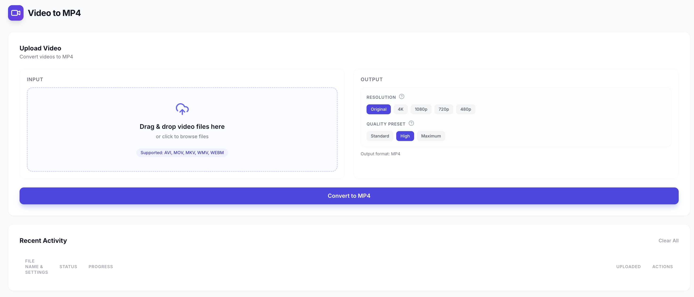
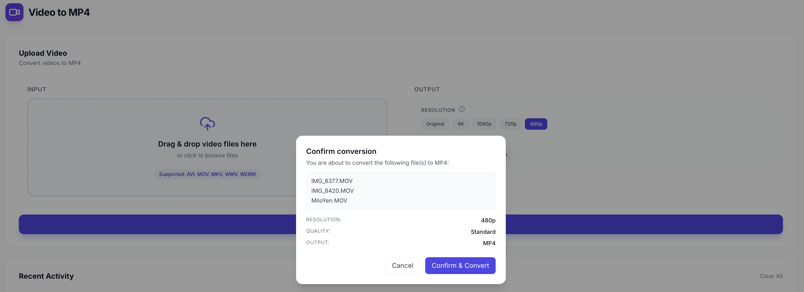
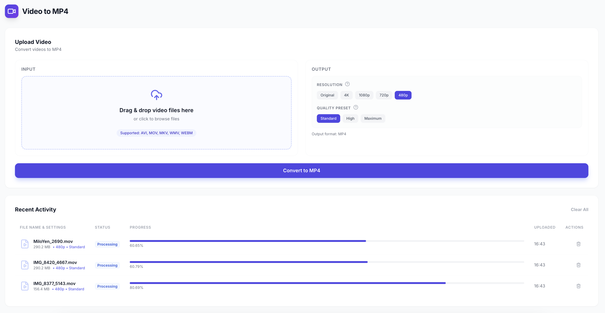

# Video to MP4

This is a web tool that converts various video formats to MP4. Users can upload videos, confirm the conversion, and let the process run in the background before retrieving the MP4 result.

## Flow (Screenshots)

1. **Open the home page and prepare to upload**



2. **Confirm the upload and start conversion**



3. **Conversion in progress**



## Project Purpose

This project provides a simple and clear “videos to MP4” conversion experience with a visual flow that shows upload, confirmation, and conversion status.

## Software Design Document (SDD)

I have a document titled [Video to MP4 - Software Design Document (SDD).pdf](docs/Video%20to%20MP4%20-%20Software%20Design%20Document%20(SDD).pdf). Everyone is encouraged to join and open-source this project together.

## Getting Started

This project is managed with [Poetry](https://python-poetry.org/).

### Prerequisites

- Python 3.11.x
- Poetry
- FFmpeg

Install FFmpeg (macOS):

```bash
brew install ffmpeg
```

### Installation

1. Ensure Poetry uses Python 3.11:

```bash
poetry env use python3.11
poetry env info
```

2. Install dependencies:

```bash
poetry install
```

### Running the App

Start the development server:

```bash
poetry run ./reflex_rerun.sh
```

The application will be available at `http://localhost:3000`.
